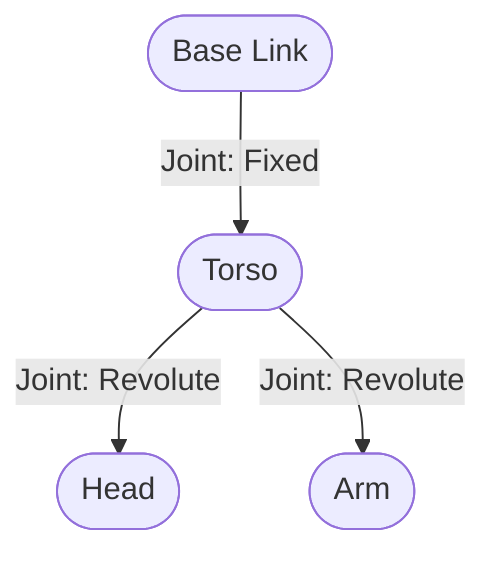

# Lesson 3: Defining the Body (URDF)

<h2>3.1 What is URDF?</h2>

Software needs a map of the body it controls. **URDF** (Unified Robot Description Format) is the XML standard for this. Ideally, a URDF file tells the software:
1.  **Visuals**: What the robot looks like (meshes, colors).
2.  **Collisions**: The physical volume (for bumping into things).
3.  **Inertia**: Mass and weight distribution (for physics calculations).
4.  **Kinematics**: How parts connect and move.

<h2>3.2 Anatomy of a Robot</h2>

Robots are defined as a tree structure of **Links** connected by **Joints**.

<h3>Links</h3>
A **Link** is a rigid part. It's a bone. It doesn't move; it just exists.
Examples: `base_link` (chassis), `upper_arm`, `hand`.

<h3>Joints</h3>
A **Joint** connects two links. It defines *how* they move relative to each other.
*   **Fixed**: No movement (e.g., neck to head, if rigidly attached).
*   **Revolute**: Rotates around an axis (e.g., elbow).
*   **Prismatic**: Slides along an axis (e.g., elevator).



<h2>3.3 Building a Simple Humanoid</h2>

Let's write a URDF for a primitive humanoid: A boxy torso and a spherical head.

Create `simple_humanoid.urdf`:

```xml title="code/module-1/simple_humanoid.urdf"
<?xml version="1.0"?>
<robot name="simple_humanoid">
  
  <!-- The Torso Link -->
  <link name="torso">
    <visual>
      <geometry>
        <!-- A box 0.3m wide, 0.5m deep, 0.8m tall -->
        <box size="0.3 0.5 0.8"/> 
      </geometry>
      <material name="blue">
        <color rgba="0 0 1 1"/>
      </material>
    </visual>
    <!-- Collision is required for physics engines -->
    <collision>
      <geometry>
        <box size="0.3 0.5 0.8"/>
      </geometry>
    </collision>
    <!-- Inertial properties are required for physics -->
    <inertial>
      <mass value="10.0"/> <!-- 10 kg -->
      <inertia ixx="1.0" ixy="0.0" ixz="0.0" iyy="1.0" iyz="0.0" izz="1.0"/>
    </inertial>
  </link>
  
  <!-- The Head Link -->
  <link name="head">
     <visual>
       <geometry>
         <sphere radius="0.15"/>
       </geometry>
       <material name="white">
         <color rgba="1 1 1 1"/>
       </material>
     </visual>
     <collision>
        <geometry>
          <sphere radius="0.15"/>
        </geometry>
     </collision>
     <inertial>
       <mass value="2.0"/>
       <inertia ixx="0.1" ixy="0.0" ixz="0.0" iyy="0.1" iyz="0.0" izz="0.1"/>
     </inertial>
  </link>
  
  <!-- The Neck Joint -->
  <!-- Connects Torso (parent) to Head (child) -->
  <joint name="neck" type="fixed">
    <parent link="torso"/>
    <child link="head"/>
    <!-- Place the head 0.4m above the center of the torso (on top) -->
    <origin xyz="0 0 0.4"/> 
  </joint>

</robot>
```

<h2>3.4 Summary</h2>

We have defined the "Body". In the next module, we will load this file into **Gazebo** to see it fall under gravity (because we haven't pinned it down yet!).

This URDF is the "Single Source of Truth" for your robot. Both the simulator (Gazebo) and the visualizer (Unity) will use this definition to reconstruct the robot.
